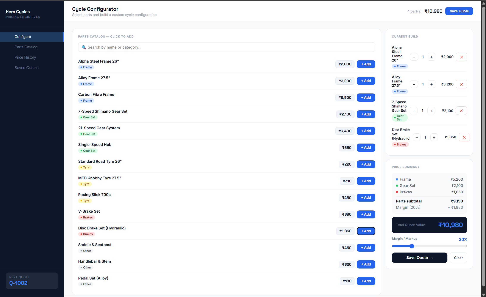
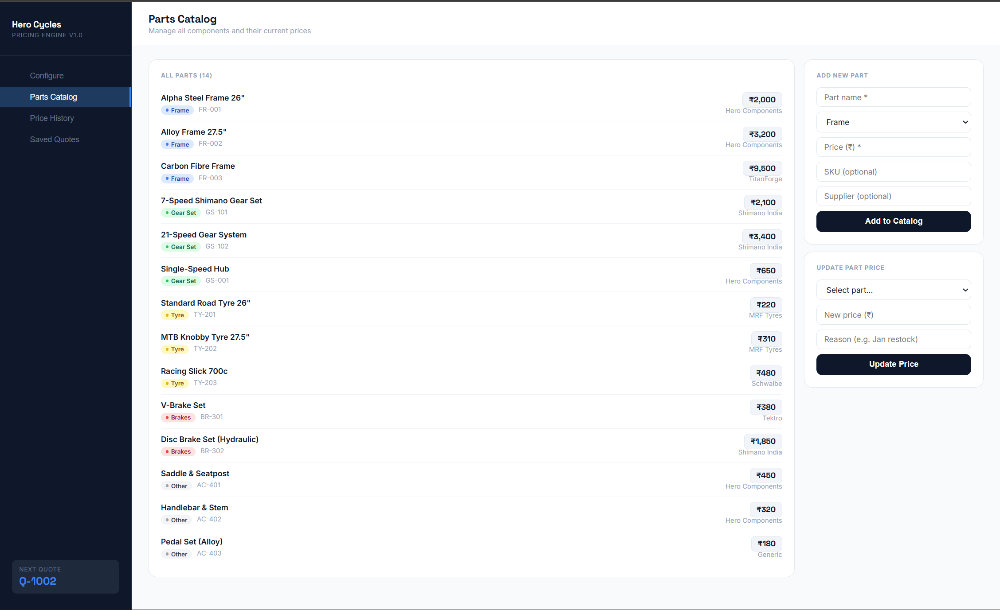
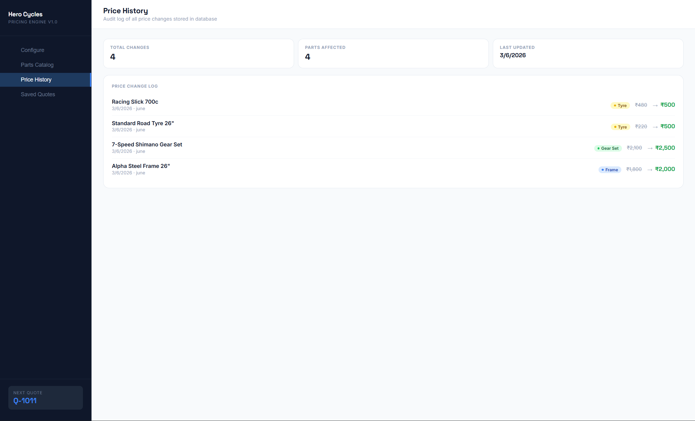
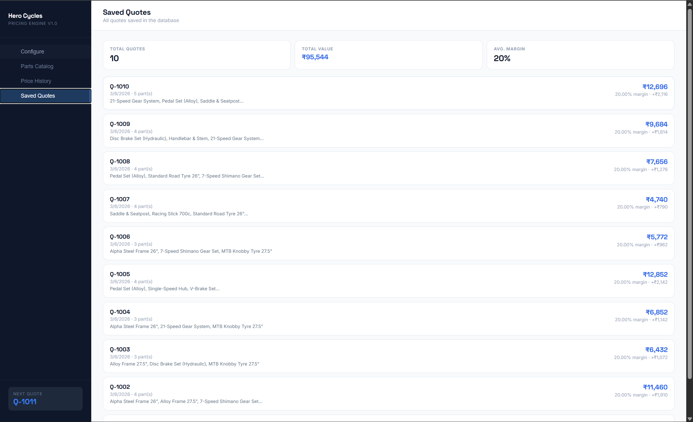

<div align="center">


# 🚲 Hero Cycles — Pricing Engine

### Full-Stack Engineer Assignment · Mohammed Sowban

[](https://djangoproject.com)
[](https://react.dev)
[](https://www.django-rest-framework.org)
[](https://sqlite.org)
[](https://python.org)

**A production-ready pricing engine for Hero Cycles' sales team — replacing Excel sheets with a real-time, database-backed configuration and quoting system.**


</div>

---

## 📸 Screenshots

| Configure & Build | Parts Catalog |
|---|---|
|  |  |

| Price History | Saved Quotes |
|---|---|
|  |  |

---

##  The Problem

Hero Cycles manages thousands of cycle configurations across different frames, gear sets, and tyre types. Part costs change every few months — a tyre priced at ₹200 in January may be ₹230 by December. The sales team was doing all of this on Excel sheets, causing:

- ❌ Stale pricing — no single source of truth
- ❌ No audit trail — who changed what price and when?
- ❌ No reusability — previously quoted builds can't be reused
- ❌ No visibility — managers can't track margins

---

##  What I Built

A full-stack pricing engine where:

-  **Sales team** can configure a cycle build from a live parts catalog and get an instant price breakdown by component
-  **Margin is adjustable** per quote (0–80%) with a live slider
-  **Parts catalog** is fully manageable — add new parts, update prices with reasons
-  **Quotes are immutable snapshots** — price changes never affect historical quotes
-  **Every price change is logged** in a permanent audit trail
-  **All data persists** in a SQLite database via Django REST API

---

##  Architecture

```
┌─────────────────────────────────┐
│        React Frontend           │
│  - Configure tab (build cycle)  │
│  - Parts Catalog tab            │
│  - Price History tab            │
│  - Saved Quotes tab             │
└────────────┬────────────────────┘
             │ REST API (JSON)
             │ http://127.0.0.1:8000/api/
┌────────────▼────────────────────┐
│    Django REST Framework        │
│  /api/parts/                    │
│  /api/parts/{id}/update-price/  │
│  /api/quotes/                   │
└────────────┬────────────────────┘
             │
┌────────────▼────────────────────┐
│         SQLite Database         │
│  Part + PriceHistory            │
│  Quote + QuoteLineItem          │
└─────────────────────────────────┘
```

---

##  Project Structure

```
hero-cycles-pricing-engine/
├── backend/
│   ├── manage.py
│   ├── requirements.txt
│   ├── db.sqlite3                  ← SQLite database
│   ├── hero_cycles/
│   │   ├── settings.py
│   │   └── urls.py
│   └── herocycles/
│       ├── models.py               ← Part, PriceHistory, Quote, QuoteLineItem
│       ├── serializers.py          ← DRF serializers
│       ├── views.py                ← API ViewSets
│       ├── urls.py                 ← API routes
│       └── admin.py                ← Django admin config
├── frontend/
│   └── src/
│       └── App.jsx                 ← Full React UI (single file)
├── docs/
│   └── wireframes.md
├── screenshots/
└── README.md
```

---

## ⚙️ Tech Stack

| Layer | Technology | Why |
|---|---|---|
| Frontend | React 18 + Vite | Fast dev server, component-driven UI |
| Backend | Django 4.2 + DRF | Admin panel out of the box, rapid API development |
| Database | SQLite | Zero config, perfect for this scope |
| Styling | Pure CSS-in-JS | No build dependencies, full control |
| Fonts | Inter + Space Grotesk | Professional, readable UI typography |

---

##  How to Run

### Backend

```bash
cd backend
python -m venv venv
venv\Scripts\activate          # Windows
pip install -r requirements.txt
python manage.py migrate
python manage.py runserver
```

Seed initial parts data:
```bash
python manage.py shell
```
```python
from herocycles.models import Part
data = [
    ("Alpha Steel Frame 26\"","Frame",1800,"FR-001","Hero Components"),
    ("7-Speed Shimano Gear Set","Gear Set",2100,"GS-101","Shimano India"),
    ("Standard Road Tyre 26\"","Tyre",220,"TY-201","MRF Tyres"),
    # ... (see full list in README)
]
for name, cat, price, sku, supplier in data:
    Part.objects.get_or_create(sku=sku, defaults=dict(name=name, category=cat, current_price=price, supplier=supplier))
exit()
```

API available at: `http://127.0.0.1:8000/api/`
Django Admin at: `http://127.0.0.1:8000/admin/`

### Frontend

```bash
cd frontend
npm install
npm run dev
```

App available at: `http://localhost:5173`

---

##  API Endpoints

| Method | Endpoint | Description |
|---|---|---|
| `GET` | `/api/parts/` | List all active parts with price history |
| `POST` | `/api/parts/` | Add a new part to catalog |
| `POST` | `/api/parts/{id}/update-price/` | Update price + log to history |
| `GET` | `/api/quotes/` | List all saved quotes |
| `POST` | `/api/quotes/` | Create and save a new quote |

### Example — Create a Quote

```json
POST /api/quotes/
{
  "line_items": [
    { "part_id": "uuid-of-frame", "quantity": 1 },
    { "part_id": "uuid-of-tyre",  "quantity": 2 }
  ],
  "margin_pct": 20
}
```

Response:
```json
{
  "id": "Q-1001",
  "total": "5208.00",
  "margin_pct": "20.00",
  "margin_amount": "868.00",
  "line_items": [
    { "part_name": "Alpha Steel Frame 26\"", "unit_price": "1800.00", "quantity": 1, "line_total": "1800.00" },
    { "part_name": "Standard Road Tyre 26\"", "unit_price": "220.00", "quantity": 2, "line_total": "440.00" }
  ]
}
```

---

##  Key Design Decisions

### 1. Quotes snapshot prices — not live references
When a quote is saved, the part name and price are **copied into the quote's line items**, not just referenced. This means if a tyre goes from ₹200 → ₹230 in December, the January quote still correctly shows ₹200. This is how every real invoicing system (Zoho, Tally, Salesforce CPQ) works.

### 2. Price history is an append-only log
Every price change creates a new `PriceHistory` record — old records are never deleted or overwritten. This gives a permanent audit trail: who changed what, when, and why.

### 3. Margin as a percentage, not fixed amount
Percentage scales naturally with build cost. 20% on a ₹5,000 city bike vs a ₹40,000 MTB are very different amounts — the percentage approach gives consistent business meaning.

### 4. Soft delete for parts
Parts are never hard-deleted — they're flagged `is_active=False`. This preserves the integrity of historical quotes that reference them.

---

##  Questions I Asked Before Building

1. How many unique parts exist today — 10s, 100s, 1000s?
2. Can one cycle use multiple quantities of the same part (e.g. 2 tyres)?
3. Is margin fixed company-wide or set per-quote by the salesperson?
4. Does this need to calculate GST separately?
5. Who updates prices — only admins, or all salespeople?
6. Should quotes be editable after saving, or immutable?
7. Does this need to integrate with an existing ERP (SAP, Tally)?
8. Should it check inventory/stock before allowing a part to be added?
9. Do parts have variants (e.g. different sizes of the same frame)?
10. Should two quotes be comparable side-by-side?

---

##  Assumptions Made

| # | Assumption | Reason |
|---|---|---|
| 1 | Prices entered manually, not from supplier API | Simpler scope for v1 |
| 2 | All prices in INR (₹) | Hero Cycles is domestic |
| 3 | GST not calculated | Pricing engine, not invoicing system |
| 4 | Margin set per-quote by salesperson | Gives flexibility |
| 5 | Saved quotes are immutable | Critical for audit integrity |
| 6 | No authentication for MVP | Real deployment needs role-based auth |
| 7 | SQLite for storage | Zero config, replaceable with PostgreSQL |

---

##  What I'd Build Next

1. **Role-based auth** — Salesperson vs Pricing Admin vs Manager
2. **PDF export** — Printable quote for customers
3. **Quote status workflow** — Draft → Sent → Accepted/Rejected
4. **Bulk price import** — Upload CSV of updated costs
5. **Price change notifications** — Alert sales team when quoted parts change price
6. **Pre-built templates** — Standard configurations (City Commuter, MTB, Road Racer)
7. **GST breakdown** — CGST/SGST for proper invoicing
8. **PostgreSQL** — Production-grade database

---

##  About Me

**Mohammed Sowban** — Python/Django Backend Developer

---

<div align="center">
  <sub>Built with ❤️ for the Hero Cycles Full-Stack Engineer Assignment</sub>
</div>
